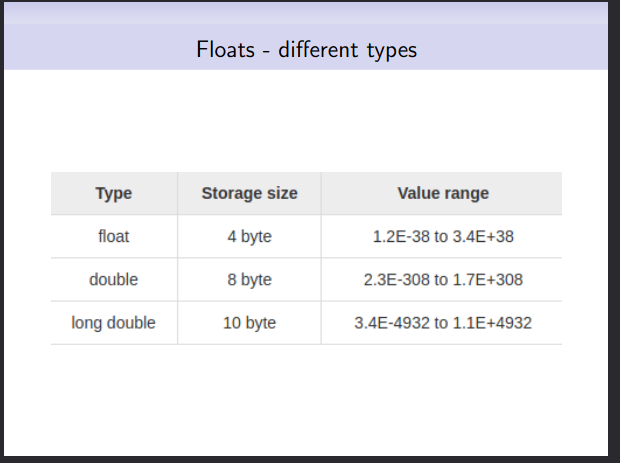

A self-taught programmer calls out nonsense: Part 1
---

This post is about incorrect claims by IIT Madras.

Screenshots of the false claims have been taken from http://www.cse.iitm.ac.in/~shwetaag/CS1100.html.

To prove my statements, I have also often included quotes from the C89 standard, because the way the programs have been written make it quite clear that they are meant to be conforming to said standard.


[

> stdio.h : standard library of input and output.

]

This is false. `<stdio.h>` does not constitute a standard library in and of itself. It is a standard header, but is not a library; the two are entirely different things.

[

> main : a function that every C program must have.

]

This is false as well. Not every program is required to have a `main`. Quoting §2.1.2.1,

> In a freestanding environment (in which C program execution may take place without any benefit of an operating system), the name and type of the function called at program startup are implementation-defined. [...]


This chart is entirely made-up. Everything presented in this chart as a fact is implementation-defined; meaning, an implementation of the language is not required to adhere by whatever is there in this chart.


[

> Typically 1 byte storage.

]

This is not quite correct. A `char` is not TYPICALLY 1 byte, rather it ALWAYS takes exactly 1 byte. Quoting §3.3.3.4,

> When applied to an operand that has type char , unsigned char , or signed char , (or a qualified version thereof) the result is 1. [...]

[

> Every character has a unique code assigned to it (ASCII code).

]

This would have been true had the word "usually" been added at the beginning of the sentence. Members of the execution character set in C has implementation-defined values, which may not correspond to the values defined in ASCII. §2.2.1 says,

> The values of the members of the execution character set are implementation-defined; any additional members beyond those required by this section are locale-specific.



This chart is completely made-up as well.


[

> Recall that a byte is made of 8 bits.

]

This is false. A byte is, in fact, not required to have exactly 8 bits. It can have 9 bits, 12 bits, even a million bits; the C standard imposes no restrictions on that. However, the number of bits in a byte should be AT LEAST 8 bits; that, repeating myself, does NOT mean that a byte is made of 8 bits in an implementation.


This program has undefined behavior because during the evaluation of `ch != '\n'` in the first iteration of the loop, `ch` is uninitialized, but I would call this off as a minor bug.


[

> In fact, math.h has such definitions to compute sqrt and pow etc.
> More interestingly, printf and scanf are also functions defined inside stdio.h

]

Both of these are false. The headers defined by the C standard only declare said functions; they never define them. Funny how they talk about definition vs declaration in a previous slide and blatantly make this error.


[

> Prototype : Not provided.

]

It is nonsense. For every call to `FindSum` in the program, `FindSum` does indeed act as a prototype. Quoting §3.7.1,

> The declarator in a function definition specifies the name of the function being defined and the identifiers of its parameters. If the declarator includes a parameter type list, the list also specifies the types of all the parameters; such a declarator also serves as a function prototype for later calls to the same function in the same translation unit. [...]


[

> void area(); // Prototype Declaration

]

Again, bullcrap. It is NOT a prototype because there is no parameter type list.


[

> By default, of type integer. Can change datatype by adding suffixes: 123456789L is a long constant, 123456789ul is an unsigned long constant etc.

]

Their use of terminologies that 3 year olds use make it very hard to understand what they exactly mean. After 10 re-reads I could finally interpret it right, and what they stated is completely false.

When you do something like so:

```
#define A 123456789

anon_type b = A;
```

the type of the constant `A` expands to is NOT required to be `int`. It can be any of `int`, `long int`, and `unsigned long int` depending on which type can represent it.


Both of these programs have undefined behavior. They are trying to use arguments of type `enum week` (and `enum escapes`) as an argument to `printf` with the `d` conversion specifier, when `d` requires an argument of type `int`.


[

> Response to modifying J depends on the system. Typically, a warning message is issued while compilation.

]

It has nothing to do with the "system". If a `const`-qualified object is modified in any way, the behavior is undefined.


[

> Find out how many dimensions your system/compiler can handle.

]

Nothing to do with the "system"; everything to do with the implementation.


False. There is nothing to ASSUME here. They are ALWAYS stored in row-major order. Quoting §3.3.2.1,

> [...] It follows from this that arrays are stored in row-major order (last subscript varies fastest).


This is one of the worst programs I have ever seen.

```
printf("address of count = %p\n", &count);
```

has undefined behavior because they are trying to use an argument of type `int *` as an argument with the `p` conversion specifier, which can only accept `void *` arguments. No, `int *` and `void *` are NOT equivalent.

```
printf("value of countPtr = %x\n", countPtr);
```

also has undefined behavior because the `x` conversion specifier expects an argument of type `int`, which `countPtr` is not.


Everything that was wrong with the previous program is in this one as well.


[

> In C-language, the name of the array is always a pointer to the beginning of the array.

]

This is not true. The name of the array is NOT always a pointer to the beginning of the array. From §3.2.2.1,

> Except when it is the operand of the sizeof operator or the unary & operator, or is a character string literal used to initialize an array of character type, or is a wide string literal used to initialize an array with element type compatible with wchar_t, an lvalue that has type ``array of type '' is converted to an expression that has type ``pointer to type '' that points to the initial member of the array object and is not an lvalue.

[

> That is, &board[0] is equivalent to board.

]

They are very much different.


We have switched to using `void main()` as the signature for `main` for some reason, which is incorrect, at least for hosted implementations, which is what they are using.


[

> Note the typecasting into (int *).

]

They claim as if the cast to `int *` is mandated by the standard. It is NOT, and the behavior is same even if you do not cast the pointer returned.

[

> Memory obtained using malloc is destroyed only when it is explicitly freed or the program terminates.

]

The standard nowhere mandate storage allocated using any of the memory management functions to be "destoryed" when the program terminates.

[

> This is unlike variables which are unavailable outside their scope.

]

Scope of an identifier has nothing to do with the lifetime of an object.


[

> In general, nums[ i ][ j ] is equivalent to *(*(nums+i)+j)

]

There is no "in general"; they ARE equivalent.


[

> However checking for equality or not equal of two structures is not supported by the language. S1 == S2 is syntax error.

]

Incorrect. It has nothing to do with anything syntactic. It is a constraint violation, not a syntactic error.


[

> Contiguous memory allocations are assigned but with some gap filler bytes to fix the memory alignment.

]

The sentence condradicts itself. To be contiguous, an object should not have any holes. Structure objects can have holes. They are NOT contiguous.


[

> This will cause segmentation fault.

]

False. It is undefined behavior. It may or may NOT cause a segmentation fault.


[

> You can do typedef to rename float to your favorite keyword.

]

You canNOT rename `float` to a keyword.

---

I have avoided mentioning any repeating errors whenever I noticed them in the slides or this post would have been double the length it is. For example, they have talked about the “<blah.h> is a standard library” that I mentioned near the beginning of this post multiple times among other things (such as writing programs with undefined behavior that is exhibited due to the use of exactly the same erroneous construct in all of them).


I also mostly talked about the incorrect concepts they are teaching in this post and ignored the programming practices aspect of their teaching. As for that, they are crap as well.

Needless to say, do NOT learn C from similar institutions that get a ton of undeserved hype.
