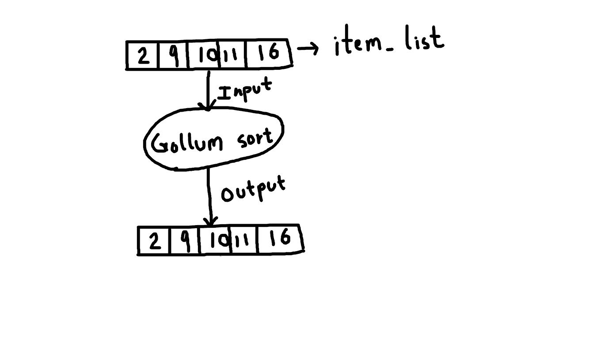

# The Gollum sort algorithm

For years, computer scientists have been trying to improve upon the existing sorting algorithms, but they have yet not succeeded in creating the fastest sorting algorithm; an algorithm to rule them all, an algorithm that can sort a list of items in constant time.

While the Quantum Bogo sort, which acted as a massive inspiration while I was working on this algorithm, is very close to being the perfect sorting algorithm, unfortunately, it requires one to be able to create and destory universes, which most of us likely are not able to. This made me spend the last two months thinking of a solution to this problem, and I realized that I could not. So I did the next best thing, which was assuming certain details to make the sorting process easier.

Think about how the binary search algorithm works; it requires the item list to be sorted before one can perform the search on it; allowing one algorithm to assume the item list to be sorted and not allowing the same for another algorithm will be discriminatory towards the algorithm, so Gollum sort assumes that the item list passed to it is already sorted.

The following are definitions of two functions in the C11 programming language that implement the Gollum sorting algorithm.

```
/* item_list must be already sorted in ascending order */
void gollum_sort_ascending(void *item_list) {
  return;
}
```
```
/* item_list must be already sorted in descending order */
void gollum_sort_descending(void *item_list) {
  return;
}
```

The first function (`gollum_sort_ascending`) must be called if an item list is to be sorted in ascending order (meaning, item with the lowest value is to be present at the beginning of the list with values of items increasing successively), and the second function (`gollum_sort_descending`) must be called if an item list is needed to be sorted in descending order (meaning, item with the highest value is to be present at the beginning of the list with values of items decreasing successively).

No restriction is put on the behavior of the aforementioned functions if the passed item list is not sorted in the right order. Trying to sort an item list with incorrect sorting order may result in behavior ranging from the program crashing to causing a zombie outbreak; no guarantees are provided.

The following sketch demonstrates the inner-workings of the algorithm.



Gollum sort has a constant time complexity unlike most sorting algorithms whose time complexity depends on the number of items in the item list. This makes it ideal for sorting large lists.

Legal notice: If you wish to use the Gollum sort algorithm in your program, you will require a license. You can acquire said license by 100%-ing the 2023 Gollum video game and sending a proof of that to the author of this post. The author is not responsible for any damages caused to anybody who uses the Gollum sort algorithm.
